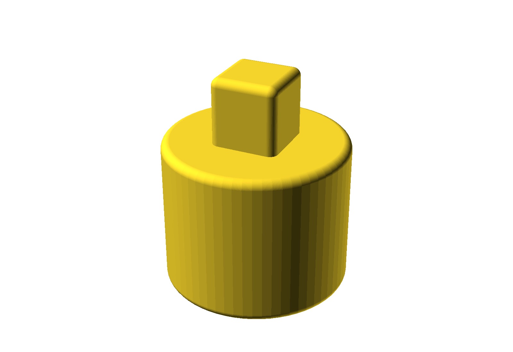

# Radiator valve cap

A push-on cap for a radiator valve spindle — the sort of thing you need when the plastic knob has
gone missing or cracked, leaving the bare valve exposed.

It's a friction fit over the valve. There's no thread and no clip: the cap slides down over the round
body of the valve and the square drive at the top, and stays there because the fit is snug.

## What it fits

The internal shape is moulded to the valve, in two parts:

| Section | Size |
| --- | --- |
| Lower round valve body | 20.0 mm diameter × 16.0 mm deep |
| Upper square drive | 6.0 × 6.0 mm × 8.0 mm deep |

**These are exact internal dimensions with no clearance added.** That's deliberate — printers vary,
and it's easier to start from the real numbers than to guess. See
[Getting the fit right](#getting-the-fit-right) below before you print a batch.

Measure your valve before printing. Radiator valve spindles are not standardised.

## Printed size

| | Diameter | Height |
| --- | --- | --- |
| Overall | 22.0 mm | 26.0 mm |

Model volume is 1.7 cm³ — call it 2 g of filament. It prints in a few minutes, which makes it cheap
to iterate on the fit.

The 1 mm wall is applied as a true 3D offset (a Minkowski sum with a 1 mm sphere), so every external
edge is rounded rather than just the vertical ones. That's what gives it the soft moulded look.

## Files

| File | What it is |
| --- | --- |
| `radiator-cap.scad` | Parametric source — edit this |
| `radiator-cap.stl` | Exported with default parameters |
| `render.png` | Preview |

## Printing

| Setting | Value |
| --- | --- |
| Material | PETG preferred — radiators get warm, and PLA softens |
| Layer height | 0.2 mm |
| Nozzle | 0.4 mm |
| Perimeters | 3 |
| Infill | 20 % |
| Supports | **None** |

Print it **open end down**, exactly as modelled — the flat open mouth on the bed, the square boss
pointing up. Nothing overhangs in that orientation.

**Use PETG rather than PLA.** A radiator valve is a warm place to leave a PLA part; it will creep and
loosen over time. PETG or ABS holds up much better.

At 1 mm the wall is only two or three extrusion widths, so 3 perimeters effectively makes it solid.
Don't go below 3.

## Getting the fit right

The internal dimensions are the *measured valve size* with no clearance, so as shipped the cap is a
tight interference fit. Depending on how your printer handles small circular holes, that will land
somewhere between "firm push" and "won't go on".

There is no clearance parameter — adjust the internal dimensions directly:

- **Too tight:** raise `lower_diameter` to 20.3 and `square_width` to 6.3.
- **Too loose:** bring them back down in 0.1 mm steps.

Print one, try it, then adjust. At 2 g a test cap costs nothing.

Note that changing `lower_diameter` or `square_width` moves the outside with it — the 1 mm wall is
offset from the internal shape, so the outer size is always internal + 2 mm.

## Parameters

| Parameter | Default | What it does |
| --- | --- | --- |
| `wall` | `1.0` | Shell thickness, applied as a rounded 3D offset |
| `lower_diameter` | `20.0` | Round valve body diameter |
| `lower_depth` | `16.0` | How far the round section goes up |
| `square_width` | `6.0` | Square drive across flats |
| `square_depth` | `8.0` | Height of the square drive |

## Note on the source

Two comments are out of date: one describes an "Exact 10 mm lower cavity" when `lower_diameter` is
20, and another a "5 x 5 mm square section" when `square_width` is 6. The code is right; the comments
were left behind when the dimensions changed.

The `minkowski()` with `$fn = 64` is what makes this small part take several seconds to render — it's
doing real work, not stuck.

## Licence

[CC BY-SA 4.0](https://creativecommons.org/licenses/by-sa/4.0/) — see [`LICENSE`](../LICENSE) in the
repo root. Print it, modify it, sell what you print; credit the original, and licence any modified
version you publish the same way.
