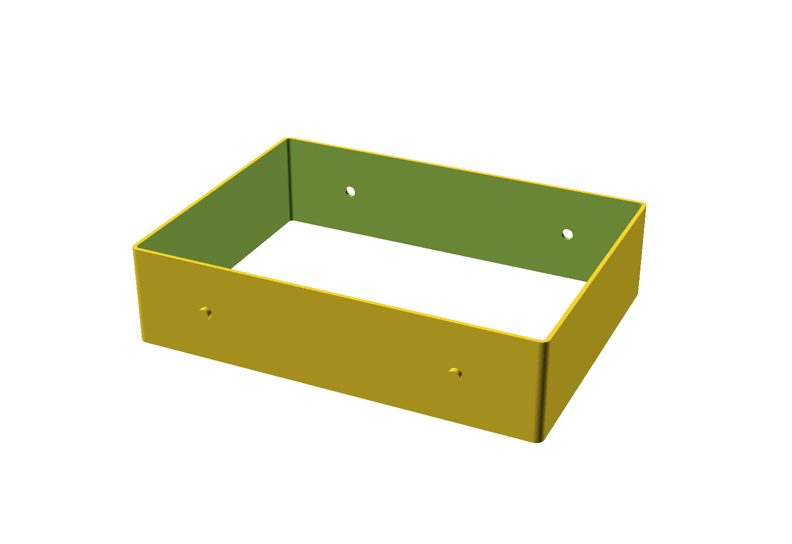

# Roller cab drawer separator

An open rectangular tray divider for a roller cabinet drawer. It has alignment pins on one long side
and matching sockets on the other, so several of them clip together side by side to fill a drawer
without sliding around.



Open top *and* bottom — it's a frame, not a tray. It sits on the drawer base and divides the space;
tools rest on the drawer liner rather than on a printed floor.

## Printed size

| | X | Y | Z |
| --- | --- | --- | --- |
| Frame | 205.0 mm | 150.0 mm | 50.0 mm |
| Including pins | 205.0 mm | 153.0 mm | 50.0 mm |

Walls are 2 mm, outer corners radiused 4 mm. Internal usable space is **201 × 146 × 50 mm**.

Model volume is 69.7 cm³. At 15 % infill expect roughly 45 g of PLA — slice it for a real number.
It's a big part; budget several hours per unit.

At 205 × 153 mm it needs a 220 mm bed to lie flat. On a 180 mm printer you'd have to reduce
`outer_length`.

## Linking them together

Two 6 mm pins project 3 mm from one long side, 40 mm in from each end. The opposite long side has two
matching 6 mm sockets in the same positions. Print several, push them together, and they stay aligned.

**The pins and sockets are both 6.0 mm with no clearance** — `hole_diameter` is commented "exact match
to pin diameter". On almost any FDM printer that will be an interference fit that won't assemble
without force or a quick pass with a file.

If you're printing more than one, open up the sockets first:

```sh
openscad -D 'hole_diameter=6.4' -o separator.stl draw-organiser.scad
```

0.3–0.4 mm of clearance is the usual starting point. Leave `pin_diameter` alone and adjust the hole —
it's easier to reason about, and the pin stays the reference dimension.

## Files

| File | What it is |
| --- | --- |
| `draw-organiser.scad` | Parametric source — edit this |
| `draw-organiser.stl` | Exported with default parameters |
| `render.png` | Preview |

## Printing

| Setting | Value |
| --- | --- |
| Material | PLA is fine; PETG if the drawer sees solvents |
| Layer height | 0.2 mm (0.3 mm is reasonable on a part this size) |
| Nozzle | 0.4 mm |
| Perimeters | 3 |
| Infill | 15 % |
| Supports | **None** |

Print it standing as modelled, open side up. The only overhang is the alignment pins, which project
horizontally — 6 mm circles bridge fine without support, though the underside of each pin will look
slightly rough. If that bothers you, a couple of support blockers under the pins alone is enough.

With 2 mm walls and 3 perimeters the frame is effectively solid, so infill barely matters. Turning it
down saves time, not much plastic.

## Parameters worth touching

| Parameter | Default | What it does |
| --- | --- | --- |
| `outer_length` | `205` | Long dimension — set from your drawer |
| `outer_width` | `150` | Short dimension |
| `height` | `50` | Wall height |
| `wall_thickness` | `2` | Frame wall |
| `corner_radius` | `4` | Outer corner rounding |
| `pin_diameter` | `6` | Alignment pin |
| `hole_diameter` | `6` | Socket — **raise this for clearance**, see above |
| `pin_end_offset` | `40` | How far the pins sit in from each end |
| `pin_length` | `3` | Pin projection |

Pins and sockets sit at half height automatically (`pin_height = height / 2`), so changing `height`
keeps them centred.

## Note on the source

**The model is defined twice.** Lines 131–163 repeat the `alignment_pin` module and the final
`union()` block that were already given above. OpenSCAD takes the later module definition and renders
both `union()` blocks, producing two coincident copies of the same solid which CGAL merges — so the
output is correct and manifold, and there's no warning.

It's harmless today but worth cleaning up: it's an accidental paste, and it doubles the geometry work
on every render. Deleting everything from line 131 to the end produces identical output.

## Licence

[CC BY-SA 4.0](https://creativecommons.org/licenses/by-sa/4.0/) — see [`LICENSE`](../LICENSE) in the
repo root. Print it, modify it, sell what you print; credit the original, and licence any modified
version you publish the same way.
