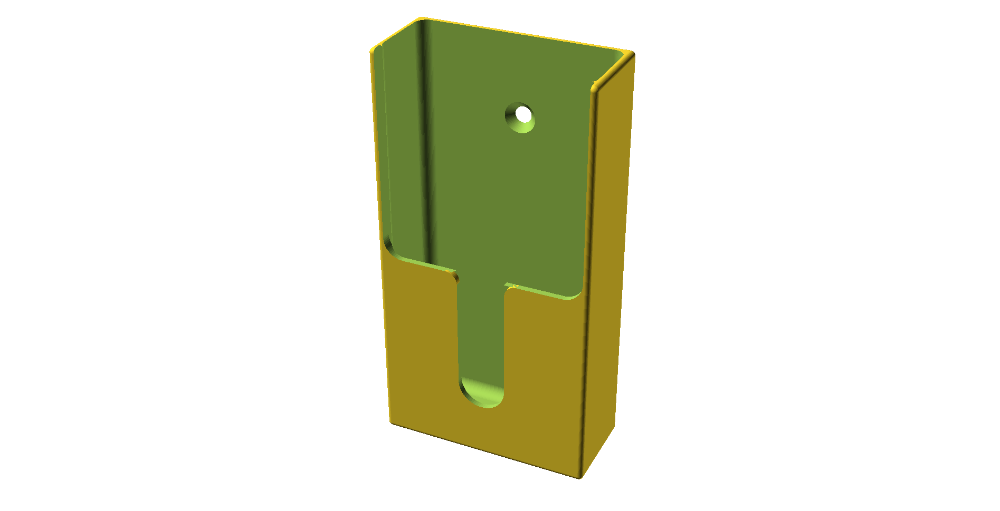

# Garage door remote wall holder

A wall-mounted pocket for a garage door remote (or any similar handset — car fob, alarm panel remote,
a slim TV remote). Screws to the wall through two countersunk holes, drops the remote in from the top,
and a channel down the front lets you get a thumb behind it to lift it back out.

Nothing to assemble — it's a single printed part.

## What it fits

The pocket is **50 × 20 mm** in cross-section and **100 mm** deep, which suits most garage door
handsets with room to spare. There's no clamping or retention: the remote sits in the pocket under
gravity, so the fit is deliberately loose.

If your remote is a different size, change `inside_width`, `inside_depth` and `inside_height` — every
outer dimension is derived from them.

## Printed size

| | X | Y | Z |
| --- | --- | --- | --- |
| Overall | 53.0 mm | 23.5 mm | 101.5 mm |

Model volume is 22.5 cm³. At 20 % infill with 3 perimeters expect roughly 18 g of PLA — slice it for
a real number.

Key features, measured from the bottom of the part:

| Feature | Position |
| --- | --- |
| Front retaining plate | z = 0 to 50 mm |
| Front access channel | z = 14 to 50 mm, 12 mm wide, rounded bottom |
| Lower screw hole | z = 20 mm |
| Upper screw hole | z = 81.5 mm |
| Screw centres | 61.5 mm apart, on the vertical centreline |

Above z = 50 mm the front is open, so the remote drops straight in.

## Files

| File | What it is |
| --- | --- |
| `garage_door_remote_holder.scad` | Parametric source — edit this |
| `garage_door_remote_holder.stl` | Exported with default parameters |
| `render.png` | Preview |

## Printing

| Setting | Value |
| --- | --- |
| Material | PLA, or PETG if it's going somewhere warm |
| Layer height | 0.2 mm |
| Nozzle | 0.4 mm |
| Perimeters | 3 |
| Infill | 15–20 % |
| Supports | **None** |

**Print it standing upright, exactly as modelled** — the open top facing up, the flat bottom on the
bed. In that orientation nothing needs support: the rounded channel bottom is a short 12 mm bridge,
and the screw holes are small horizontal holes that bridge fine.

Don't lay it on its back. The front plate would then sit 21.5 mm above the bed attached only along
its edges, and would need support underneath.

It's a tall, narrow print (101.5 mm on a 53 × 23.5 mm footprint), so make sure the first layer is
well stuck down. A brim helps if your bed adhesion is marginal.

## Mounting

Two 4 mm clearance holes on the vertical centreline, 61.5 mm apart, countersunk on the **inside** of
the pocket for an 8 mm screw head. Drive the screws from inside the holder into the wall; the heads
recess into the countersinks and sit clear of the remote.

The load is mostly a tipping moment rather than straight pull-out — the weight of the remote hangs
forward of the wall — so the top screw does most of the work. Into plasterboard, use proper plugs or
anchors rather than driving straight into the board.

## Parameters worth touching

Everything lives in named variables in the upper half of the `.scad`.

| Parameter | Default | What it does |
| --- | --- | --- |
| `inside_width` | `50` | Pocket width — set from your remote |
| `inside_depth` | `20` | Pocket depth — set from your remote |
| `inside_height` | `100` | Pocket height |
| `front_height` | `50` | How far up the front plate reaches |
| `channel_width` | `12` | Width of the front thumb channel |
| `screw_hole_d` | `4` | Screw shank clearance |
| `screw_head_d` | `8` | Screw head diameter, sets the countersink |
| `lower_hole_z` | `20` | Lower screw height — **also sets the channel bottom**, see below |
| `upper_hole_z` | derived | `outer_height - 20` |
| `rear_wall` | `2.0` | Back plate thickness |
| `side_wall` / `front_wall` / `bottom_wall` | `1.5` | Shell thicknesses |

## Notes if you start changing things

**`lower_hole_z` does double duty.** It sets the lower screw height *and* the bottom of the front
channel (`front_channel()` uses it for both). Move the screw and the channel moves with it. If you
want them independent, give the channel its own variable.

**The countersink is as deep as the back plate.** `countersink_depth` works out at
`(screw_head_d - screw_hole_d) / 2` = 2.0 mm, and `rear_wall` is also 2.0 mm, so the cone runs the
full thickness and leaves a feather edge around the rim. It prints and it works, but if you want a
more solid seat for the screw head, either raise `rear_wall` to 3 mm or use a screw with a smaller
head.

**Two stale comments in the source** describe an "8 mm channel"; `channel_width` is actually 12 mm.
`channel_radius` is calculated but never used — `front_channel()` uses `channel_width` directly.

## Licence

[CC BY-SA 4.0](https://creativecommons.org/licenses/by-sa/4.0/) — see [`LICENSE`](../LICENSE) in the
repo root. Print it, modify it, sell what you print; credit the original, and licence any modified
version you publish the same way.
