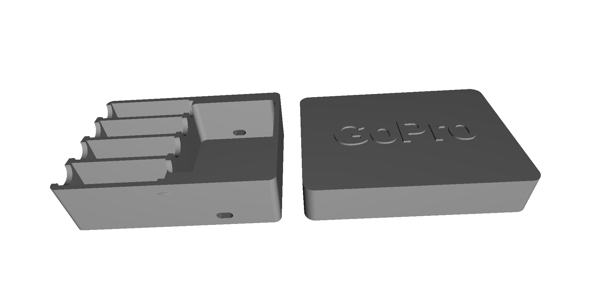

# GoPro HERO11 battery + dual charger case

A snap-lid storage case that holds **four loose GoPro batteries** in individual slots alongside the
**OEM dual charger**, so the whole charging kit travels as one block instead of rattling around a
camera bag.



The lid slides down over the base and clicks into two low-profile detents on the long sides. No
hinges, no screws, no printed threads — just push it on and pull it off.

## What it fits

| Item | Nominal size used | Notes |
| --- | --- | --- |
| GoPro Enduro / HERO9–12 battery | 40.7 × 33.6 × 13.0 mm | 4 slots. Same battery body across HERO9, 10, 11 and 12 |
| GoPro OEM dual charger (ADDBD-211) | 42 × 50 × 32 mm | 1 bay |

These are the **nominal** figures the model ships with. Published dimensions get rounded and printers
vary, so if you want a calibrated fit, measure yours and update the numbers — see
[Dialling in the fit](#dialling-in-the-fit) below.

The charger bay is optional. Set `charger_enabled = false` and you get a plain 4-slot battery case
that's about half the footprint.

## Printed size

| | X | Y | Z |
| --- | --- | --- | --- |
| Base | 91.1 mm | 65.6 mm | 26.0 mm |
| Lid | 95.7 mm | 69.0 mm | 20.0 mm |
| **Assembled** | **95.7 mm** | **69.0 mm** | **40.0 mm** |

Base Y includes the 0.6 mm snap bumps; lid Z includes the 1 mm raised lettering. Both parts fit
comfortably on any 180 mm bed.

Model volume is 47 cm³ (base) and 26 cm³ (lid). At 20 % infill with 3 perimeters expect roughly 35 g
and 22 g of PLA — slice it for a real number.

Batteries stand 9.8 mm proud of the base and the charger 8.2 mm, which is deliberate: you pinch the
top of a battery and lift it straight out rather than fishing it out of a deep hole. The lid has
1 mm of headroom above the tallest stored item.

## Files

| File | What it is |
| --- | --- |
| `gopro11_battery_case_v9_5_dual_charge_ports_fixed.scad` | Parametric source — edit this |
| `gopro11_battery_case_v9_5_dual_charge_ports_fixed.stl` | Base **and** lid, laid out side by side with default parameters |
| `render.png` | Preview |

The STL contains both parts at once. Most slicers will happily print them together; if yours objects,
or you want to print them in different colours, export separately:

```sh
openscad -D 'part="base"' -o base.stl gopro11_battery_case_v9_5_dual_charge_ports_fixed.scad
openscad -D 'part="lid"'  -o lid.stl  gopro11_battery_case_v9_5_dual_charge_ports_fixed.scad
```

`part` also accepts `"assembled"`, which shows the lid seated on the base — useful for checking
clearances visually, not for printing.

## Printing

| Setting | Value |
| --- | --- |
| Material | PLA (PETG if it lives in a hot car) |
| Layer height | 0.2 mm |
| Nozzle | 0.4 mm |
| Perimeters | 3 |
| Infill | 15–20 % |
| Supports | **None** |

Walls are 2.4 mm (outer), 2.0 mm (battery dividers) and 2.2 mm (floor) — all clean multiples of a
0.4 mm nozzle.

### Orientation matters for the lid

**Base:** print as modelled, open side up, flat on the bed. Nothing tricky.

**Lid:** print **top face down** — the embossed "GoPro" lettering against the build plate, opening
facing up. The letters print as first-layer islands and the 2.2 mm lid top bridges over them, which
works fine.

Do *not* print the lid the other way up. Opening-down would leave the entire 91 × 65 mm lid ceiling
as an unsupported bridge, and it will sag.

**The lid ships in the STL opening-down**, because that's how it's modelled sitting on the base. Your
slicer will not fix this for you — flip the lid 180° about X or Y after loading it. The base is
already the right way up and needs nothing.

## The snap fit

The two oval bumps on the long sides of the base project 0.6 mm. The lid's internal clearance is
0.3 mm, so the effective interference is **0.3 mm** — enough to click, not enough to fight.

The bumps sit low in the overlap, so the lid slides down **4.35 mm** — most of its 6 mm travel —
before it even touches them. That means the lid is already square and located before it starts to
deflect, which is what stops it going on crooked.

First fit is usually a little stiff. It loosens after a few cycles as the lid wall takes a set.

If the snap is wrong for your printer:

- **Too tight / won't seat:** drop `snap_protrusion` to `0.50`, or raise `lid_clearance` to `0.35`.
- **Too loose / falls off:** raise `snap_protrusion` to `0.70`.
- **Don't want it at all:** `snap_detents = false` gives a plain friction lid.

Change these in steps of 0.05 mm. It's a small effect with a big feel difference.

## Parameters worth touching

Everything lives in the `USER PARAMETERS` block at the top of the `.scad`. These are the ones that
actually matter:

| Parameter | Default | What it does |
| --- | --- | --- |
| `part` | `"both"` | `"base"`, `"lid"`, `"both"` or `"assembled"` |
| `slots` | `4` | Number of battery slots. The case grows in Y automatically |
| `battery_clearance` | `0.20` | Per side. 0.15 very snug, 0.20 snug, 0.25–0.30 easy sliding |
| `charger_clearance` | `0.40` | Per side. Deliberately looser — the OEM dimensions are rounded |
| `charger_enabled` | `true` | `false` drops the charger bay entirely |
| `lid_clearance` | `0.30` | Per side, between base outside and lid inside |
| `snap_protrusion` | `0.60` | How far the detent bumps stick out |
| `lid_text` | `"GoPro"` | Embossed lid lettering |
| `lid_text_enabled` | `true` | `false` for a plain lid |
| `base_height` | `26.0` | How much of the battery the base swallows |

After a render (`F6`) the OpenSCAD console prints every derived dimension — finished size, pocket
sizes, snap engagement, port positions. Check there before exporting rather than measuring the model.

Note: `lid_text_size` is fixed at 16 pt. If you set `lid_text` to something much longer than
"GoPro", drop the size or it will overrun the lid.

## Dialling in the fit

The model separates *object* dimensions from *clearance* values on purpose. Tune them independently:

1. Measure your battery and charger with calipers.
2. Update `battery_long` / `battery_height` / `battery_thick` and `charger_x` / `charger_y` /
   `charger_height` to the measured values.
3. Leave the clearances alone at first — they're the printer allowance, not the part allowance.
4. Print, and only then adjust `battery_clearance` in 0.05 mm steps if it's tight or sloppy.

Printing one battery slot as a test coupon (`slots = 1`, `charger_enabled = false`) costs a few
grams and a few minutes, and saves reprinting the whole case.

## Known limitation: the charging ports

There's an oval opening through both short ends of the charger bay, intended to let you run a cable
to the charger while it's stored.

**As shipped, this opening is too small to pass a USB-C plug.** It's 7.0 × 3.6 mm; a bare USB-C plug
is 8.25 × 2.4 mm and a typical cable's moulded boot is 10–14 mm wide. Today it works as an alignment
and status-LED window, not as cable access.

It's also a fairly deep opening. With `slots = 4` the case is wider in Y than the charger bay needs,
which leaves 6.8 mm of solid material at each end for the cutter to pass through.

If you want working cable access:

- Widen the opening — try `charge_port_width = 13.0` and `charge_port_height = 8.0`. There's plenty
  of room; the top of the opening would still sit well below the lid line.
- And/or set `slots = 3`. That drops the case to the charger bay's own width, and the opening becomes
  a clean 2.4 mm wall cut instead of a 6.8 mm tunnel.

Verify the port height against your own charger before committing — `charge_port_bottom_offset`
(default 2.0 mm) sets the *lower edge* of the oval above the charger's base.

Fixing this properly is on the list.

## Revision

Current revision is v9.5: the v9 baseline plus a single through-axis cutter that guarantees the
charging-port openings on both short faces are identical and perfectly aligned.

Verified to render cleanly and manifold in OpenSCAD 2021.01 in all four `part` modes. The committed
STL matches the current source.
