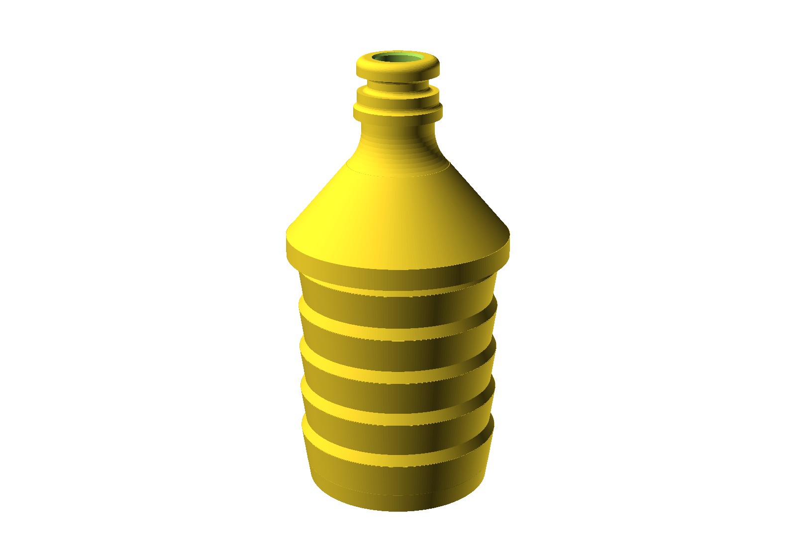
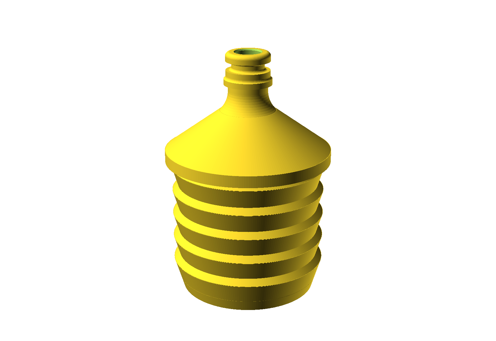
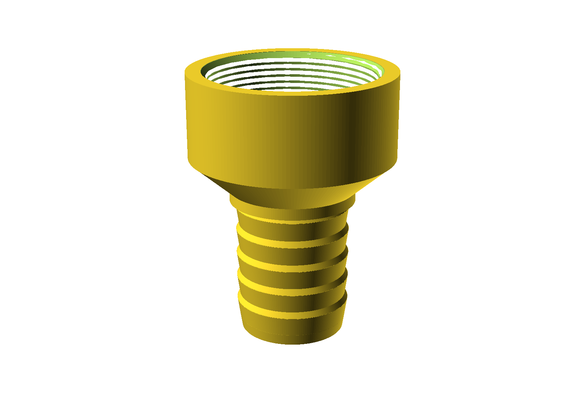

# Hose and IBC adapters

Three one-piece printable adapters for connecting large-bore hose to Gardena-style quick connectors
and to 2" BSP fittings — the sort of plumbing you end up doing around an IBC tank or a water butt.

Unlike the other folders in this repo, this one holds **three related designs** rather than one.

| Design | From | To | Size |
| --- | --- | --- | --- |
| [1.5" barb → Gardena](#15-barb--gardena) | 39.6 mm ID hose | Gardena-style male quick connect | Ø44 × 87 mm |
| [2" barb → Gardena](#2-barb--gardena) | 50.8 mm ID hose | Gardena-style male quick connect | Ø59 × 87 mm |
| [2" female → 1.5" barb](#2-female--15-barb) | 39.6 mm ID hose | 2" BSPP (G2) female socket | Ø72 × 94 mm |

---

## 1.5" barb → Gardena

For hose measured at **39.6 mm internal diameter**. Five barb teeth grip the hose; the other end is a
Gardena-style male quick connect.

| | |
| --- | --- |
| Overall | Ø44.0 × 86.7 mm |
| Barb crest OD | 39.8 mm |
| Barb root OD | 37.8 mm |
| Lead-in OD | 36.5 mm |
| Model volume | 32.6 cm³ |

The lead-in is 3.1 mm under the crest diameter, so the hose starts easily and tightens as it goes on.
Use a hose clip over the barb — the teeth locate it, the clip seals it.

`1-5inchbarb-to-Gardena.scad` · `1-5inchbarb-to-Gardena.stl`

---

## 2" barb → Gardena

Same Gardena end, sized for **2" / 50.8 mm ID** hose. The barb section runs 44 mm (34 mm plus a 10 mm
extension) with five complete teeth over the full engagement length.

| | |
| --- | --- |
| Overall | Ø59.0 × 86.7 mm |
| Barb peak OD | 54.5 mm |
| Barb root OD | 50.4 mm |
| Lead-in OD | 48.0 mm |
| Gardena bore | 9.0 mm, flaring to 10.0 mm over the last 0.5 mm |
| Model volume | 99.6 cm³ |

Note the **9 mm bore** through the Gardena end. That's the restriction for the whole fitting — it's
set by the Gardena profile, not by choice, so don't expect 2" flow through it.

`2inchbarb-to-Gardena.scad` · `2inchbarb-to-Gardena.stl`

---

## 2" female → 1.5" barb

Screws onto a **2" BSP male** fitting — typically an IBC tank outlet — and converts it to a 39.6 mm
hose barb.

| | |
| --- | --- |
| Overall | Ø72.0 × 93.75 mm |
| Thread | G2 / 2" BSPP parallel, 20 mm engagement |
| Socket body | Ø72.0 mm |
| Barb | 44 mm long, 5 teeth, 39.8 mm crest |
| Through bore | 31.0 mm at the barb |
| Model volume | 87.4 cm³ |

### It seals on a washer, not the thread

**G2 / BSPP is a parallel thread.** The thread clamps and locates; it does *not* seal. The watertight
joint is made by a flat rubber washer at the bottom of the socket, and there is a machined seat for
one:

| Gasket seat | |
| --- | --- |
| Recess diameter | 61.0 mm |
| Recess depth | 2.2 mm |
| Suits a washer of | ~48 mm ID × ~60 mm OD × 2 mm, EPDM or similar |

Measure your washer before you rely on those numbers. Without one, this fitting **will** weep — no
amount of tightening will fix it, because plastic thread flanks aren't a seal.

Don't reach for PTFE tape as a substitute. It's the right answer on a tapered BSPT thread and the
wrong one here.

`2inch_female-to-1-5inch_barb.scad` · `2inch_female-to-1-5inch_barb.stl`

---

## Printing

These are pressure-bearing water fittings, so they want printing differently from an ordinary part.

| Setting | Value |
| --- | --- |
| Material | PETG — better layer adhesion and more UV/water tolerant than PLA |
| Layer height | 0.2 mm |
| Nozzle | 0.4 mm |
| Perimeters | **4–6** |
| Infill | 40 %+, or enough that walls meet solidly |
| Supports | **None** |

Print each one **standing on its widest flat end**, axis vertical, as modelled. Everything is a
surface of revolution, so nothing overhangs.

**Perimeters matter more than infill.** Leaks in printed fittings come from gaps between perimeters,
not from thin infill. Four to six perimeters on a part this size is effectively solid and gives you
the watertight path. Slowing down a little helps too.

Treat these as **low-pressure** fittings — gravity feed from an IBC or water butt, not mains pressure.
Pressure-test outdoors before trusting one indoors.

## Fit and calibration

The Gardena mating profile was **reconstructed from a supplied STL**, not from a published standard,
so test-fit against your own connector before printing several. The `$fn = 240` on the two Gardena
adapters is there to keep those profiles smooth — it's why they take a while to render.

Every dimension is a named parameter at the top of each file. The ones you're most likely to change:

| Parameter | What it does |
| --- | --- |
| `hose_id` / `hose_measured_id` | Measured internal diameter of your hose |
| `barb_peak_d` | Crest diameter — the number that decides grip |
| `barb_root_d` | Diameter between teeth |
| `barb_tip_d` | Lead-in, keep it well under the crest |
| `bsp_fit_clearance_radial` | Thread clearance on the BSP socket |
| `gasket_recess_d` / `gasket_recess_depth` | Washer seat, set from your washer |

Measure the hose ID with calipers on the actual hose — nominal hose sizes are approximate, which is
why these files quote a *measured* 39.6 mm rather than "1.5 inch".

## Licence

[CC BY-SA 4.0](https://creativecommons.org/licenses/by-sa/4.0/) — see [`LICENSE`](../LICENSE) in the
repo root. Print it, modify it, sell what you print; credit the original, and licence any modified
version you publish the same way.
