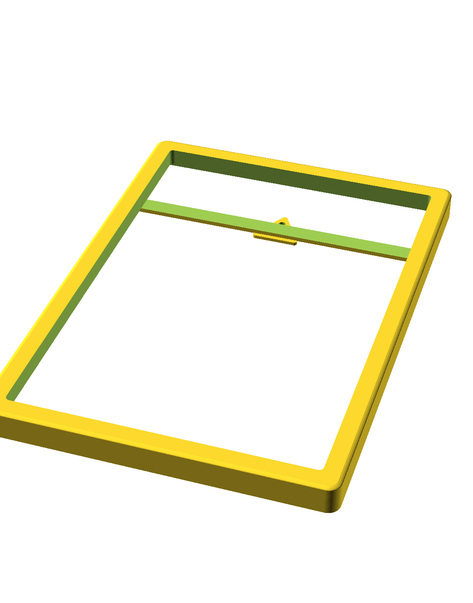

# Portrait art frame (v2)

A printed picture frame for a specific piece of portrait artwork, with a curved front moulding, a
recessed rear bridge and an integrated triangular hanger. No glass, no backing board, no hardware
beyond a screw or nail in the wall.

## What it fits

| | Size |
| --- | --- |
| Artwork | 213 × 307 mm, 4 mm thick |
| Visible opening | 197 × 291 mm |
| Lip covering the artwork | 8 mm all round |

The artwork drops into a pocket from the back and sits behind a 2 mm front retaining lip. Clearance is
**0.30 mm per side** with **0.40 mm** extra depth, so it goes in without forcing but doesn't rattle.

The design also allows for an existing lip on the artwork itself (12 mm wide, 3 mm high) — set by
`art_existing_lip_width` and `art_existing_lip_height`. If your piece is a plain flat panel, those can
go to zero.

## Printed size

| | X | Y | Z |
| --- | --- | --- | --- |
| Overall | 223.0 mm | 317.0 mm | 21.1 mm |

That's the artwork plus a 5 mm border on each side. Model volume is 197.9 cm³ — roughly 160 g of PLA
at 20 % infill, and a long print.

**It will not fit a 220 mm bed.** At 223 × 317 mm you need a 250 × 350 mm build area or larger. On a
smaller printer, reduce `frame_border_width`, print it diagonally, or split the model.

Depth breaks down as a 10 mm curved front moulding, the artwork pocket, a 3 mm rear structural wall,
and a 2 mm triangular hanger projecting behind that.

## Files

| File | What it is |
| --- | --- |
| `picture_frame_v2.scad` | Parametric source — edit this |
| `picture_frame_v2.stl` | Exported with default parameters |
| `render.png` | Preview |

## Printing

| Setting | Value |
| --- | --- |
| Material | PLA |
| Layer height | 0.2 mm |
| Nozzle | 0.4 mm |
| Perimeters | 3 |
| Infill | 15–20 % |
| Supports | **None** |

Print it **face down** — the curved front moulding against the bed, rear bridge and hanger pointing
up. The moulding then forms itself against the build plate and comes out smooth, and the rear
features build upward with no overhangs.

It's a large flat part, so warping and bed adhesion are the real risks rather than geometry. A brim is
worth it, and keep it out of a draught.

## Hanging

A 12 mm wide bridge crosses the back horizontally, recessed into the 3 mm rear wall so it sits flush
rather than proud. A 32 × 28 mm triangular hanger sits centrally on that bridge, overlapping it by
15 mm so the joint is solid, with a 5 mm hole 9 mm down from the tip.

The bridge sits 95 mm above centre (`bridge_y_position`), which puts the hanging point in the upper
third — the frame hangs plumb rather than tipping forward.

Hang it on a single screw or nail. The load path is hanger → bridge → side rails, all printed in one
piece, so there's nothing to come apart, but do remember it's a printed part carrying a moment: don't
hang it from something that flexes.

## Parameters worth touching

| Parameter | Default | What it does |
| --- | --- | --- |
| `art_width` / `art_length` | `213` / `307` | Artwork size — the two that matter most |
| `art_thickness` | `4` | Artwork thickness |
| `art_clearance` | `0.30` | Pocket clearance per side |
| `depth_clearance` | `0.40` | Extra pocket depth |
| `raised_visible_width` / `_length` | `197` / `291` | Size of the visible opening |
| `frame_border_width` | `5` | Border outside the artwork, each side |
| `front_lip_thickness` | `2` | Front retaining lip |
| `front_curve_height` | `10` | Height of the curved moulding |
| `curve_squareness` | `3.5` | Moulding profile — higher is squarer |
| `outer_corner_radius` | `8` | Outer corner rounding |
| `bridge_y_position` | `95` | Hanging point height above centre |
| `hanger_hole_diameter` | `5` | Hanging hole |

Outer size is derived (`art_width + 2 × frame_border_width`), so setting the artwork dimensions
resizes the whole frame.

## Licence

[CC BY-SA 4.0](https://creativecommons.org/licenses/by-sa/4.0/) — see [`LICENSE`](../LICENSE) in the
repo root. Print it, modify it, sell what you print; credit the original, and licence any modified
version you publish the same way.
